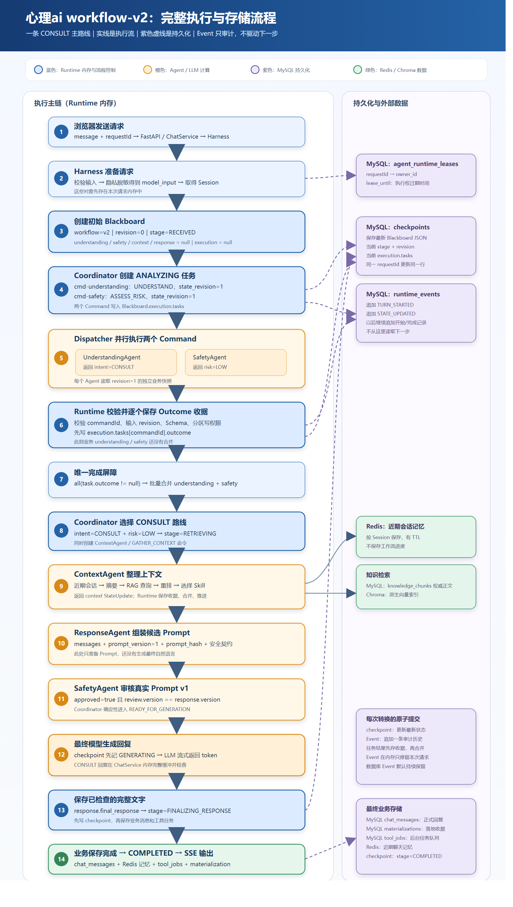

# 心理ai workflow-v2 详细流程与存储图

> 更新于 2026-09-12。本文只描述一条正常的 CONSULT 咨询路线，重点说明每一步由谁执行、产生什么数据，以及数据保存在内存、MySQL、Redis 还是 Chroma。

## 一、先记住五个存储结论

~~~text
Runtime 内存        负责正在执行和计算
MySQL checkpoint   负责保存当前执行到哪里
MySQL Event        负责保存以前每一步发生了什么
Redis              负责保存近期聊天记忆
Chroma             负责保存和查询向量索引
~~~

workflow-v2 的下一步由以下内容决定：

~~~text
flow.current_stage
+ execution.tasks 中的任务完成情况
+ Blackboard 中已经合并的业务结果
+ Coordinator 中的固定转换规则
~~~

Event 不决定下一步，也不进入请求内存队列。它是追加式审计记录。

## 二、一条完整 CONSULT 主路线

示例输入：

> 我最近考试压力很大，连续几晚睡不好，今晚可以先做什么？

> 点击图片可在 Markdown 阅读器中查看原始尺寸；SVG 矢量版位于同目录的“心理ai-workflow-v2-详细流程图.svg”。

Mermaid 源码（需要修改图时再展开）

~~~mermaid
sequenceDiagram
    autonumber

    actor User as 用户/浏览器
    participant API as FastAPI / ChatService
    participant H as Harness
    participant DB as MySQL
    participant RT as WorkflowRuntime（内存）
    participant C as Coordinator（确定性规则）
    participant D as Dispatcher
    participant U as UnderstandingAgent
    participant S as SafetyAgent
    participant CTX as ContextAgent
    participant R as ResponseAgent
    participant LLM as 最终生成模型
    participant Redis as Redis
    participant Chroma as Chroma

    User->>API: POST message + requestId
    API->>H: prepare_chat()

    Note over H: [内存] 校验输入、脱敏 得到 model_input

    H->>DB: 获取 requestId 租约
    DB-->>H: owner + lease_until

    H->>RT: run_async(model_input, requestId, lease)
    RT->>DB: 查询 agent_runtime_checkpoints
    DB-->>RT: 新请求，没有 checkpoint

    Note over RT: [内存] 创建 Blackboard stage=RECEIVED revision=0

    RT->>C: start(Blackboard)
    Note over C: 根据 RECEIVED 选择 ANALYZING

    C-->>RT: 两个 AgentCommand UNDERSTAND + ASSESS_RISK

    Note over RT: [内存] Blackboard revision=1 stage=ANALYZING execution.tasks 保存两个命令

    RT->>DB: 同一事务：更新 checkpoint
    RT->>DB: 同一事务：追加 TURN_STARTED、STATE_UPDATED
    Note over DB: checkpoint 表保存当前状态 Event 表保存审计记录

    Note over RT: [内存] 将两个任务标记 started=true

    RT->>DB: 更新 checkpoint：任务已开始
    RT->>DB: 追加两个 AGENT_STARTED Event

    RT->>D: iter_outcomes(commands, revision=1 快照)

    par Understanding 并行执行
        D->>U: UNDERSTAND + Blackboard 独立快照
        U-->>D: AgentStateUpdate intent=CONSULT
    and Safety 并行执行
        D->>S: ASSESS_RISK + Blackboard 独立快照
        S-->>D: AgentStateUpdate risk=LOW
    end

    D-->>RT: Understanding AgentExecutionOutcome

    Note over RT: [内存] 校验 commandId、revision、Schema、写分区

    RT->>DB: 更新 checkpoint.execution.tasks 保存 Understanding Outcome
    RT->>DB: 追加 AGENT_COMPLETED Event

    D-->>RT: Safety AgentExecutionOutcome

    Note over RT: [内存] 校验 Safety Outcome

    RT->>DB: 更新 checkpoint.execution.tasks 保存 Safety Outcome
    RT->>DB: 追加 AGENT_COMPLETED Event

    Note over RT: [内存] 完成屏障 两个 task.outcome 都不为空

    RT->>RT: 批量合并 understanding + safety
    RT->>C: advance(合并后的 Blackboard)

    Note over C: intent=CONSULT risk=LOW 所以 route=CONSULT

    C-->>RT: stage=RETRIEVING 创建 GATHER_CONTEXT 命令

    RT->>DB: 同一事务：保存合并结果、route、Context任务
    RT->>DB: 追加 ROUTE_SELECTED、STATE_UPDATED

    RT->>D: 执行 ContextCommand
    D->>CTX: GATHER_CONTEXT + Blackboard 快照

    CTX->>Redis: 读取近期会话
    Redis-->>CTX: 最近聊天记录

    CTX->>Chroma: 查询相关知识向量
    Chroma-->>CTX: 候选知识片段

    Note over CTX: [内存] 整理历史 RAG 重排 选择 Skill

    CTX-->>D: ContextStateUpdate
    D-->>RT: Context AgentExecutionOutcome

    RT->>DB: 保存 Context Outcome 收据
    RT->>DB: 追加 AGENT_COMPLETED Event

    RT->>RT: 合并 context
    RT->>C: advance()
    C-->>RT: stage=PREPARING_RESPONSE 创建 PREPARE_RESPONSE 命令

    RT->>DB: 保存 context + Response任务
    RT->>DB: 追加 STATE_UPDATED

    RT->>D: 执行 ResponseCommand
    D->>R: PREPARE_RESPONSE + Blackboard 快照

    Note over R: [内存] 组装 messages 生成 prompt_version=1 计算 prompt_hash 生成安全契约

    R-->>D: ResponseStateUpdate
    D-->>RT: Response AgentExecutionOutcome

    RT->>DB: 保存 Response Outcome 收据
    RT->>DB: 追加 AGENT_COMPLETED Event

    RT->>RT: 合并 response
    RT->>C: advance()
    C-->>RT: stage=PROMPT_REVIEW 创建 REVIEW_RESPONSE 命令

    RT->>DB: 保存 response + Safety审核任务
    RT->>DB: 追加 STATE_UPDATED

    RT->>D: 执行 Safety Review
    D->>S: REVIEW_RESPONSE 读取真实 messages + version + 安全契约

    Note over S: [内存] 审核 Prompt v1 approved=true review version=1

    S-->>D: SafetyStateUpdate
    D-->>RT: Review AgentExecutionOutcome

    RT->>DB: 保存 Review Outcome 收据
    RT->>DB: 追加 AGENT_COMPLETED Event

    RT->>RT: 合并 safety.prompt_review
    RT->>C: advance()

    Note over C: approved=true review version == prompt version

    C-->>RT: stage=READY_FOR_GENERATION

    RT->>DB: 保存 READY_FOR_GENERATION checkpoint
    RT->>DB: 追加 TURN_READY_FOR_GENERATION

    RT-->>H: 返回审核通过的 Prompt 和 Blackboard

    H->>DB: 保存用户消息、报告、Trace、业务收据
    H-->>API: 返回 AgentHarnessOutcome

    API->>DB: checkpoint 更新为 GENERATING
    API->>DB: 追加 GENERATION_STARTED

    API->>LLM: response.messages
    LLM-->>API: 流式返回 token

    Note over API: [内存] CONSULT 回复完整缓冲 执行输出安全检查

    API->>DB: checkpoint 保存 final_response stage=FINALIZING_RESPONSE
    API->>DB: 追加 GENERATION_OUTPUT_READY

    API->>DB: 保存助手正式消息
    API->>Redis: 写入近期对话记忆
    API->>DB: 写入需要的 tool_jobs 更新业务物化收据

    API->>DB: checkpoint 更新为 COMPLETED
    API->>DB: 追加 GENERATION_COMPLETED、TURN_COMPLETED

    API-->>User: SSE token
    API-->>User: SSE done
~~~

## 三、初始 Blackboard

新请求进入 Runtime 后，先在内存创建：

~~~yaml
workflow_version: workflow-v2
revision: 0

request:
  request_id: req-001
  user_id: 1001
  session_id: session-001
  model_input: 我最近考试压力很大，连续几晚睡不好……
  prompt_injection_signals: []

understanding: null
safety: null
context: null
response: null

flow:
  current_stage: RECEIVED
  route: null
  active_batch: null
  review_attempts: 0

execution: null
~~~

这一刻 Blackboard 是 Runtime 内存中的工作对象。Coordinator 创建第一步任务后，Runtime 才把它持久化到 checkpoint。

## 四、第一步 AgentCommand 存在哪里

Coordinator 根据 RECEIVED 创建：

~~~yaml
execution:
  tasks:
    cmd-understanding-001:
      command:
        command_id: cmd-understanding-001
        batch_id: batch-001
        agent: UnderstandingAgent
        action: UNDERSTAND
        state_revision: 1
      started: false
      outcome: null

    cmd-safety-001:
      command:
        command_id: cmd-safety-001
        batch_id: batch-001
        agent: SafetyAgent
        action: ASSESS_RISK
        state_revision: 1
      started: false
      outcome: null
~~~

AgentCommand 同时存在于：

1. 当前 Runtime 的 Blackboard 内存对象；
2. MySQL agent_runtime_checkpoints.state_json 的 execution.tasks 中。

Event 只记录 commandId、actor、action 等审计信息，不依赖 Event 把命令交给 Dispatcher。

## 五、单个 Agent 完成时怎样保存

假设 Understanding 先完成，Safety 还在运行。

Runtime 内存和数据库 checkpoint 中会保存：

~~~yaml
workflow_version: workflow-v2
revision: 3

flow:
  current_stage: ANALYZING
  route: null

understanding: null
safety: null

execution:
  tasks:
    cmd-understanding-001:
      started: true
      outcome:
        command:
          command_id: cmd-understanding-001
          agent: UnderstandingAgent
          action: UNDERSTAND
          state_revision: 1
        success: true
        degraded: false
        attempts: 1
        duration_ms: 850
        update:
          section: understanding
          data:
            intent: CONSULT
            topic: mental_health_support
            reason: 用户正在咨询考试焦虑

    cmd-safety-001:
      started: true
      outcome: null
~~~

此时 Understanding 结果已经作为任务收据持久化，所以 Runtime 崩溃后能够复用。但 understanding 业务分区仍然为空，因为本步骤的 Safety 尚未完成。

同一次提交还会向 agent_runtime_events 追加 AGENT_COMPLETED，保存这次任务的 commandId、成功状态、尝试次数、耗时和 Outcome。

## 六、两个 Agent 收齐后怎样推进

唯一的完成屏障是：

~~~python
all(
    task.outcome is not None
    for task in execution.tasks.values()
)
~~~

两个任务都完成后：

~~~text
Runtime 校验两个 Outcome
→ 批量合并 understanding 和 safety
→ Coordinator 读取 intent=CONSULT、risk=LOW
→ 计算 route=CONSULT
→ 创建 ContextCommand
→ 一次提交业务结果、下一阶段和下一任务
~~~

最新 checkpoint 变成：

~~~yaml
flow:
  current_stage: RETRIEVING
  route: CONSULT

understanding:
  intent: CONSULT
  reason: 用户正在咨询考试焦虑

safety:
  risk_level: LOW

execution:
  tasks:
    cmd-context-001:
      command:
        agent: ContextAgent
        action: GATHER_CONTEXT
      started: false
      outcome: null
~~~

旧的 Understanding/Safety 任务被当前 Context 任务替换。它们的详细执行历史继续保存在 agent_runtime_events 中。

## 七、Context、Response 和 Safety Review

ContextAgent 读取当前业务状态、近期会话和知识库，返回 context：

~~~yaml
context:
  memory_brief: 用户近期主要有考试压力和睡眠问题
  model_history: [...]
  retrieved_knowledge:
    - chunk_id: knowledge-001
      source: sleep-guide.md
      content: ...
      score: 0.82
  selected_skills:
    - supportive_response_baseline
    - campus_support_toolkit
~~~

ResponseAgent 消费已经合并的 request、understanding、safety 和 context，组装候选 Prompt：

~~~yaml
response:
  prompt_version: 1
  prompt_hash: sha256-...
  messages:
    - role: system
      content: 系统规则、Skill、安全契约和 RAG 证据
    - role: user
      content: 用户脱敏输入
  generation_status: WAITING_FOR_SAFETY_REVIEW
  policy_contract:
    requires_non_diagnostic: true
    requires_immediate_safety_check: false
    requires_human_support: false
~~~

SafetyAgent 随后审核同一版本的真实 messages：

~~~yaml
safety:
  prompt_review:
    prompt_version: 1
    approved: true
    issues: []
    reason: Prompt 满足当前安全契约
~~~

Coordinator 检查：

~~~python
review.approved is True
and review.prompt_version == response.prompt_version
~~~

满足条件后直接进入 READY_FOR_GENERATION，不再创建 FINALIZE_RESPONSE AgentCommand。

## 八、最终文字怎样保存

ChatService 使用审核通过的 response.messages 调用最终生成模型。

生成开始前：

~~~yaml
flow:
  current_stage: GENERATING
~~~

CONSULT 回复会先完整缓冲在 ChatService 内存中。通过输出检查后，完整文字先写入 checkpoint：

~~~yaml
flow:
  current_stage: FINALIZING_RESPONSE

response:
  final_response: 我能理解连续几晚睡不好会让考试压力更难承受……
~~~

接着保存：

~~~text
MySQL chat_messages         助手正式消息
Redis                       近期会话记忆
MySQL tool_jobs             需要执行的后台工具任务
MySQL materializations      业务落地状态
~~~

业务保存完成后：

~~~yaml
flow:
  current_stage: COMPLETED
~~~

然后把已经检查过的完整回复通过 SSE 发给浏览器。

## 九、每类数据究竟存在哪里

| 数据 | 执行期间 | 持久化位置 | 保存方式 |
|---|---|---|---|
| Blackboard | Runtime 内存对象 | MySQL agent_runtime_checkpoints.state_json | 同一个 requestId 更新最新快照 |
| flow.current_stage | Blackboard 内存 | checkpoint 的 JSON 和 stage 列 | 随 checkpoint 更新 |
| AgentCommand | execution.tasks 内存 | checkpoint 的 execution.tasks | 当前步骤结束后被下一步任务替换 |
| AgentStateUpdate | Agent 返回时暂存在内存 | 先进入 Outcome，然后合并进 checkpoint | 校验后保存 |
| AgentExecutionOutcome | Runtime 内存 | 当前步骤保存在 checkpoint；历史明细进入 Event | 每个 Agent 完成后单独提交 |
| Event | 当前请求的 journal 内存列表 | MySQL agent_runtime_events | 每次新增一行 |
| 最终生成 token | ChatService 内存缓冲 | 不逐 token 入库 | 检查完成后保存完整文本 |
| 最终回复 | ChatService 和 Blackboard 内存 | checkpoint + chat_messages | 先存 checkpoint，再存正式消息 |
| 完整聊天记录 | 请求处理时读取到内存 | MySQL chat_messages | 长期业务记录 |
| 近期聊天记忆 | Agent 使用时读取到内存 | Redis | 按 Session 保存并过期 |
| RAG 原始知识 | Context 使用时读取到内存 | MySQL knowledge_chunks | 权威知识副本 |
| RAG 向量 | Context 查询时使用 | Chroma | 派生向量索引 |
| 工具任务 | 创建时短暂存在内存 | MySQL tool_jobs | 持久任务队列 |
| 请求执行权 | Harness 持有租约对象 | MySQL agent_runtime_leases | owner + 过期时间 |

## 十、内存和数据库的整体关系

存储关系已经直接标注在上方成品图的右侧区域。下面的 Mermaid 仅作为可编辑源码保留，默认折叠。

存储关系 Mermaid 源码（可选）

~~~mermaid
flowchart TD
    A["用户请求 message + requestId"] --> B["Harness 内存 校验、脱敏、Session"]
    B --> L[("MySQL agent_runtime_leases requestId 执行权")]
    B --> R["WorkflowRuntime 内存"]

    R --> BB["当前 Blackboard"]
    R --> CMD["当前 AgentCommand"]
    R --> OUT["当前 AgentExecutionOutcome"]
    R --> J["本次 Event journal"]

    BB --> TX["状态转换提交"]
    CMD --> TX
    OUT --> TX
    J --> TX

    TX --> CP[("MySQL agent_runtime_checkpoints 最新状态 + 当前任务收据")]
    TX --> EV[("MySQL agent_runtime_events 每一步历史明细")]

    R --> CTX["ContextAgent"]
    CTX --> M[("Redis 近期会话记忆")]
    CTX --> K[("MySQL knowledge_chunks 知识权威副本")]
    CTX --> V[("Chroma 向量索引")]

    R --> G["ChatService 内存 最终回复缓冲和安全检查"]
    G --> CP
    G --> MSG[("MySQL chat_messages 正式回复")]
    G --> M
    G --> JOB[("MySQL tool_jobs 后台任务")]
    G --> SSE["SSE 输出给浏览器"]
~~~

## 十一、Event 会保存多久

Event 的生命周期是：

~~~text
Runtime 在内存中创建 RuntimeEvent
→ 放入本次调用的 journal 列表
→ 与 checkpoint 同事务写入 MySQL
→ 请求结束后，内存对象可以释放
→ MySQL agent_runtime_events 继续保留
~~~

当前项目没有自动删除 agent_runtime_events 的定时策略，所以数据库中的 Event 默认持续保存，直到增加数据保留策略或人工清理。

workflow-v2 没有 Event 内存队列：

~~~text
Event 内存对象        本次请求期间短暂存在
Event journal 列表    本次 Runtime 返回执行轨迹
agent_runtime_events  数据库中的长期审计记录
~~~

## 十二、面试表达

> 项目有四个业务 Agent，Coordinator 是确定性调度器，不是第五个 LLM Agent。新请求由显式工作流推进：Runtime 根据当前阶段创建 AgentCommand，Dispatcher 执行，Agent 返回局部 StateUpdate，Runtime 将它包装成 Outcome 并先写入 checkpoint 作为任务收据。当前阶段全部任务完成后，Runtime 统一合并 Blackboard，Coordinator 根据 intent、risk 和 Prompt 审核结果选择下一步。Blackboard 同时是内存工作对象和 checkpoint 的持久快照；Event 只追加记录每个步骤的命令、结果、耗时和路由历史，不参与调度。
